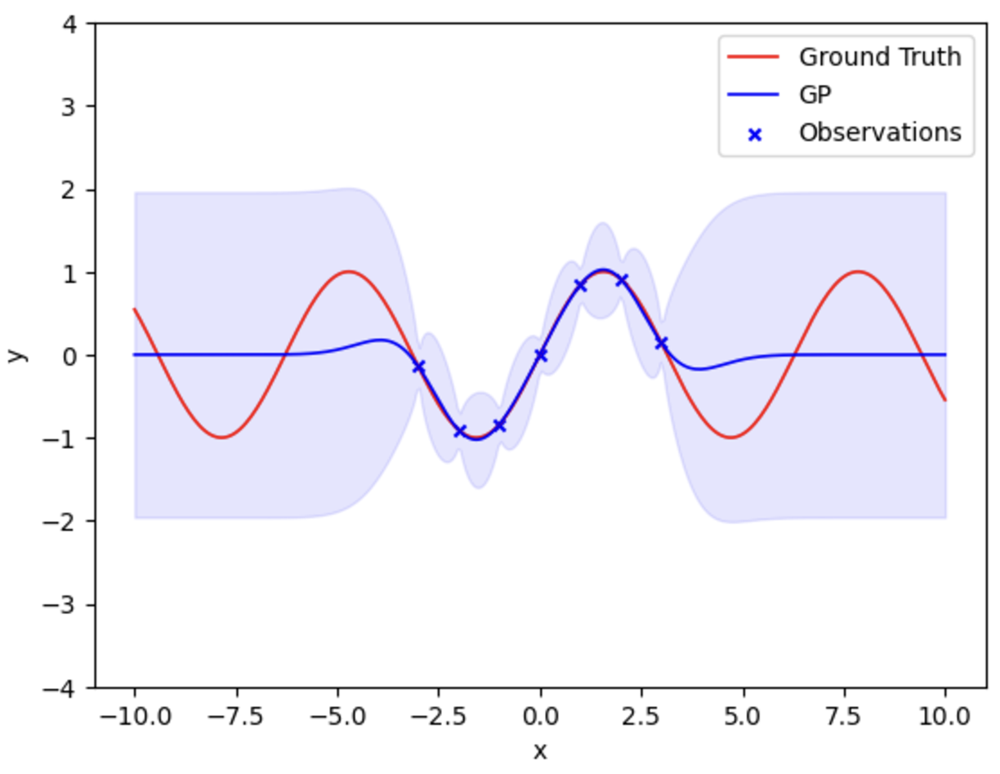
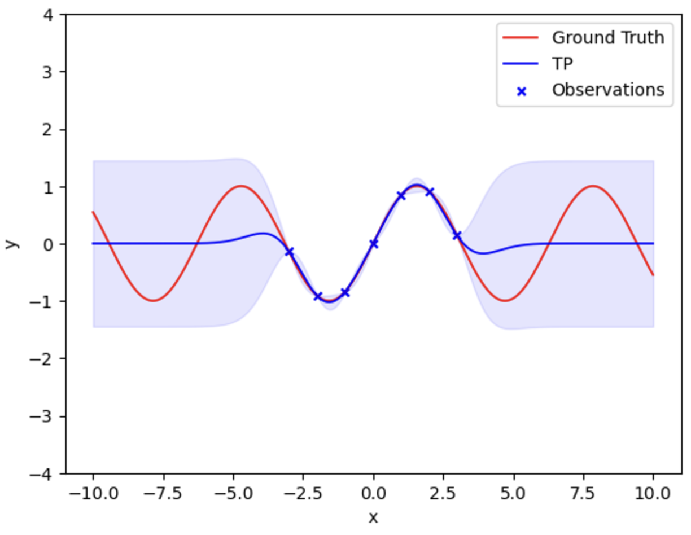

:math:`t` Process in Scikit Learn
=================================

This is a simple demo showcasing the integration of :math:`t` processes
(TP)s into the scikit learn python package. First, the existing
functionality of Gaussian Processes (GP)s will be demonstrated, then the
same will be done for TPs showcasing their similar interfaces and
behavioural differences.

This is not meant to be a coprehensive overview of GPs and TPs, for more
background information see [RW2006], [SW2014], [TW2018] and [S2024].

Scikit Learn Gaussian Processes Interface
-----------------------------------------

A simple example of GP regression in scikit learn is as follows:

.. code:: ipython3

    from sklearn.gaussian_process import GaussianProcessRegressor
    from sklearn.gaussian_process.kernels import RBF, ConstantKernel, ExpSineSquared
    import numpy as np

    X_train = np.array([[-3], [-2], [-1], [0], [1], [2], [3]])
    Y_train = np.sin(X_train)
    X_predict = np.array([[-1.5], [-0.5], [0.5], [1.5]])

    kernel = RBF(1, length_scale_bounds="fixed")

    gpr = GaussianProcessRegressor(kernel=kernel, alpha=0.0001).fit(X_train, Y_train)
    means, stds = gpr.predict(X_predict, return_std=True)

    print('\nMean of predictions:')
    print(means)
    print('\n Standard deviation of predictions:')
    print(stds)

.. parsed-literal::

    Mean of predictions:
    [-1.02199222 -0.4616725   0.4616725   1.02199222]

     Standard deviation of predictions:
    [0.08621517 0.0786525  0.0786525  0.08621517]

To better visualize the predictions they can be plotted:

.. code:: ipython3

    X_predict = np.linspace(-10, 10, num=300).reshape(-1, 1)
    Y_true = np.sin(X_predict)

    means, stds = gpr.predict(X_predict, return_std=True)
    confs = vec_norm_conf_gp(stds)
    topConf = means + confs
    botConf = means - confs

    plot_stochastic_process(X_predict, Y_true, means, botConf, topConf, 'GP')

:math:`t` Processes Interface
-----------------------------

In short, TPs are generated by placing a conjugate prior over the
covariance matrix of a GP then subsequently marginalizing it out. There
are two primary advantages of using TPs over GPs: 1. TPs scale the
covariance of the stochastic process in a Bayesian way. 2. The marginal
distributions of TPs are :math:`t` distributions, making them *heavier
tailed* and thus more robust to outliers.

Much of the literature focuses on the second property of TPs [SW2014],
[TW2018] and [RW2006].

The primary disadvantage of TPs are that they cannot handle noisy
observations analytically. This implementation uses the common approach
of adding noise to the covariance matrix before a prior is placed over
it as proposed by [SW2014]. See [S2024] for a deeper analysis of this
and approximation techniques of noisy Bayesian TPs.

:math:`t` Processes in Scikit Learn
~~~~~~~~~~~~~~~~~~~~~~~~~~~~~~~~~~~

This `fork <https://github.com/conradstevens/scikit-learn>`__ of scikit
learn implements TPs as a subclass of GPs giving a simple interface
similar to that of GPs in scikit learn. Consider the following example:

.. code:: ipython3

    from sklearn.gaussian_process import TProcessRegressor

    X_train = np.array([[-3], [-2], [-1], [0], [1], [2], [3]])
    Y_train = np.sin(X_train)
    X_predict = np.array([[-1.5], [-0.5], [0.5], [1.5]])

    kernel = RBF(1, length_scale_bounds="fixed")

    tpr = TProcessRegressor(kernel=kernel, alpha=0.0001, v=5).fit(X_train, Y_train)
    means, stds = tpr.predict(X_predict, return_std=True)

    print('\nMean of predictions:')
    print(means)
    print('\n Standard deviation of predictions:')
    print(stds)

.. parsed-literal::

    Mean of predictions:
    [-1.02199222 -0.4616725   0.4616725   1.02199222]

     Standard deviation of predictions:
    [0.06274391 0.0572401  0.0572401  0.06274391]

Remark, the mean values are the same, however the standard deviation is
smaller as a result of scaling the covariance in a Bayesian way. See
below the sin wave example using TPs:

.. code:: ipython3

    X_predict = np.linspace(-10, 10, num=300).reshape(-1, 1)

    means, stds = tpr.predict(X_predict, return_std=True)
    confs = vec_norm_conf_tp(stds, tpr.v)
    topConf = means + confs
    botConf = means - confs

    plot_stochastic_process(X_predict, Y_true, means, botConf, topConf, 'TP')

It can be seen the covariance of the distribution is scaled down
following the observations. Also note the marginal distributions at each
:math:`x` index are :math:`t` distributions.

GP and TP Sampled Regressions
-----------------------------

To demonstrate the *heavier tailed* properties of TPs versus GPs a
series of regression can be sampled from each prior and compared.

.. image:: sklearn/gaussian_process/media/figures/output_14_0.png

It can be seen that as a consequence of the :math:`t` distribution
shape, sampled regressions from the TP prior are more volatile and
extend outside the bounds more often.

Kernel Parameter Training
-------------------------

In the previous examples, kernel parameters were fixed to best show the
scaling properties of TPs. This section will show the implementation of
kernel parameter training used to maximize the log-likelihood of the
observed data, theoretically giving kernel of best fit:

.. raw:: html

   

:math:`\max_{\theta} \; \ln\bigl(p(Z_n)\bigl)`

.. raw:: html

   

Where :math:`\theta` are the kernel parameters and :math:`Z_n` are the
observed data points.

Gaussian Process Kernel Parameter Training
~~~~~~~~~~~~~~~~~~~~~~~~~~~~~~~~~~~~~~~~~~

The kernel parameter training technique implemented in scikit learn is
based of [RW2006] Algorithm 2.1 and scipy’s *fmin_l_bfgs_b* optimizer.
To compute the log-likelihood and its derivative, first consider:

.. math::

   &\text{Let } K:= K_{nn} + \Sigma_z \\
   &\text{Let } Y:= Z_n - \phi(T_n) \\
   &\text{Let } L := \text{Cholesky}(K) \\
   &\text{Let } l_{ii} := \text{the }i^{th} \text{ diagonal of $L$} \\
   &\text{Let } \alpha := L^T\backslash(L\backslash Y) \\
           &\;\;\;\;\;\;\;\;\;\;= K^{-1}Y

Where :math:`Z_n` are the observed points. Then:

.. math::

       \begin{align}
           \ln(p(Z_n)) &= -\frac{1}{2} Y^TK^{-1}Y - \frac{1}{2}\ln(|K|) - \frac{n}{2}\ln(2\pi)  \\
           &= -\frac{1}{2}Y^T \alpha - \frac{1}{2}\ln(|LL^T|) - \frac{n}{2}\ln(2\pi) \\
           &= \frac{1}{2}Y\alpha - \sum_{i=1}^n \bigl( \ln(l_{ii}) \bigr) - \frac{n}{2}\ln(2\pi)
       \end{align}

and

.. math::

   \begin{align}
           \frac{\partial}{\partial \theta_1}\ln(p(Z_n)) &= \frac{1}{2}Y^TK^{-1} \frac{\partial K}{\partial \theta_1} K^{-1} Y - \frac{1}{2}\text{tr}(K^{-1} \frac{\partial K}{\partial \theta_1})\\
           &= \frac{1}{2} \alpha^T \frac{\partial K}{\partial \theta_1} \alpha - \frac{1}{2}\text{tr}(K^{-1} \frac{\partial K}{\partial \theta_1}) \\
           &= \frac{1}{2}(\text{tr}\Bigl(\alpha\alpha^T\frac{\partial K}{\partial \theta_1} \Bigl) - \text{tr}\Bigl(K^{-1} \frac{\partial K}{\partial \theta_1}\Bigl))\\
           &= \frac{1}{2}\text{tr}\Bigl(\alpha\alpha^T\frac{\partial K}{\partial \theta_1} - K^{-1} \frac{\partial K}{\partial \theta_1}\Bigl) \\
           &= \frac{1}{2} \text{tr} \Bigl( (\alpha \alpha^T - K^{-1}) \frac{\partial K}{\partial \theta_1} \Bigl) \\
       \end{align}

These are implemented in the GaussianProcessRegressor class as:

.. code:: ipython3

    def _log_likelihood_calc(slef, y_train, alpha, L, K):
        """Returns the log-likelihood of the multivariate Gaussian distribution.

        Parameters
        ----------
        y_train : array-like of shape (n_samples,) or (n_samples, n_targets)
                  Target values.

        alpha : K^(-1) * y_train

        L : Lower cholesky decomposition of the kernel matrix K.

        K : Kernel matrix used.

        Returns
        -------
        log_likelihood : float
            Log-marginal likelihood of multivariate Gaussian distribution using
            covariance K and training data
        """
        log_likelihood_dims = -0.5 * np.einsum("ik,ik->k", y_train, alpha)
        log_likelihood_dims -= np.log(np.diag(L)).sum()
        log_likelihood_dims -= K.shape[0] / 2 * np.log(2 * np.pi)
        # the log likehood is sum-up across the outputs
        log_likelihood = log_likelihood_dims.sum(axis=-1)
        return log_likelihood

    def _log_likelihood_gradient_calc(self, alpha, L, K, K_gradient):
        """Returns the log-likelihood gradient given the required algebraic terms.

        Returns
        -------
        log_likelihood_gradient : np.array
            Log-marginal likelihood gradient with respect to theta
        """
        inner_term = np.einsum("ik,jk->ijk", alpha, alpha)
        K_inv = cho_solve(
            (L, GPR_CHOLESKY_LOWER), np.eye(K.shape[0]), check_finite=False
        )
        log_likelihood_gradient_dims = 0.5 * np.einsum(
            "ijl,jik->kl", inner_term, K_gradient
        )
        log_likelihood_gradient = log_likelihood_gradient_dims.sum(axis=-1)
        return log_likelihood_gradient

Kernel parameter training can easily be used by :

.. code:: ipython3

    X_train = np.array([[-3], [-2], [-1], [0], [1], [2], [3]])
    Y_train = np.sin(X_train)

    kernel = RBF(1, length_scale_bounds=[0.01, 10])
    gpr = GaussianProcessRegressor(kernel=kernel, alpha=0.0001, n_restarts_optimizer=100).fit(X_train, Y_train)

    X_predict = np.linspace(-10, 10, num=300).reshape(-1, 1)
    Y_true = np.sin(X_predict)

    means, stds = gpr.predict(X_predict, return_std=True)
    confs = vec_norm_conf_gp(stds)
    topConf = means + confs
    botConf = means - confs

    plot_stochastic_process(X_predict, Y_true, means, botConf, topConf, 'GP')

:math:`t` Process Kernel Parameter Training
-------------------------------------------

At a high level, the kernel parameter training algorithm used to train
TPs is the same as what is used to train GPs. However, the equations for
log-likelihood and its derivative are different. This training algorithm
has been proposed by [SW2014] and [TW2018], however, never optimized and
implemented untill [S2024]. To compute the log-likelihood and its
derivative, first consider:

.. math::

   \begin{align}
   &\text{Let } \Psi_{nn} := \frac{v_0-2}{v_0}(K_{nn} + \Sigma_z) \\
   &\text{Let } Y:= Z_n - \phi(T_n) \\
   &\text{Let } L := \text{Cholesky}(\Psi_{nn}) \\
   &\text{Let } l_{ii} := \text{the }i^{th} \text{ diagonal of $L$} \\
   &\text{Let } \alpha := \Psi_{nn}^T\backslash(\Psi_{nn}\backslash Y) \\
           &\;\;\;\;\;\;\;\;\;\;= \Psi_{nn}^{-1}Y
   \end{align}

Then:

.. math::

   \begin{align}
   \ln(p(Z_n)) &= \Gamma(\frac{v_0 + n}{2}) - \Gamma(\frac{v_0}{2}) - \frac{n}{2}\ln(v_0\pi) - \frac{1}{2} \ln(|\Psi_{nn}|) - \frac{v_0 + n}{2} \ln(1 + \frac{(\phi(T_n) - \check{Z}_n)^T \Psi_{nn}^{-1} (\phi(T_n) - \check{Z}_n)}{v_0}) \\
   &= \Gamma(\frac{v_0 + n}{2}) - \Gamma(\frac{v_0}{2}) - \frac{n}{2}\ln(v_0\pi) - \frac{1}{2} \ln(|K|) - \frac{v_0 + n}{2} \ln(1 + \frac{Y^T K^{-1} Y}{v_0}) \\
   &= \Gamma(\frac{v_0 + n}{2}) - \Gamma(\frac{v_0}{2}) - \frac{n}{2}\ln(v_0\pi) - \frac{1}{2} \ln(|LL^T|) - \frac{v_0 + n}{2} \ln(1 + \frac{Y^T \alpha}{v_0}) \\
   &= \Gamma(\frac{v_0 + n}{2}) - \Gamma(\frac{v_0}{2}) - \frac{n}{2}\ln(v_0\pi) - \sum_{i=1}^n\bigl( \ln(l_{ii}) \bigr) - \frac{v_0 + n}{2} \ln(1 + \frac{Y^T \alpha}{v_0}) \\
   &= \Gamma(\frac{v_0 + n}{2}) - \Gamma(\frac{v_0}{2}) - \frac{n}{2}\ln(v_0\pi) - \sum_{i=1}^n\bigl( \ln(l_{ii}) \bigr) - \frac{v_0 + n}{2} \ln(1 + \frac{(\phi(T_n) - \check{Z}_n)^T \alpha}{v_0})
   \end{align}

and

.. math::

   \begin{align}
   \frac{\partial}{\partial \theta_1}\ln\bigl(p(Z)\bigl) &= \frac{\partial}{\partial \theta_1} \Bigl((-\frac{1}{2}\ln(|\Psi_{nn}|)\Bigl) + \frac{\partial}{\partial \theta_1} \Bigl( - \frac{v_0 + n}{2}\ln \bigl( 1+\frac{(\phi(T_n) - \check{Z}_n)^T \Psi_{nn}^{-1} (\phi(T_n) - \check{Z}_n)}{v_0}\bigl) \Bigl) \\
   &= \frac{\partial}{\partial \theta_1} \Bigl((-\frac{1}{2}\ln(|\psi_{nn}|)\Bigl) + \frac{\partial}{\partial \theta_1} \Bigl( - \frac{v_0 + n}{2}\ln \bigl( 1+\frac{Y^T \psi_{nn}^{-1}Y}{v_0}\bigl) \Bigl) \\
   &= \frac{v_0 + n}{v_0+Y^T \psi_{nn}^{-1} Y} \times \frac{1}{2} Y^T\psi_{nn}^{-1} \frac{\partial \psi_{nn}}{\partial \theta_1} \psi_{nn}^{-1} Y - \frac{1}{2}\text{tr}(\psi_{nn}^{-1} \frac{\partial \psi_{nn}}{\partial \theta_1})\\
   &= \frac{v_0 + n}{v_0 + Y^T\alpha}\times\frac{1}{2} \text{tr}(\alpha\alpha^T \frac{\partial \psi_{nn}}{\partial \theta_1}) - \frac{1}{2}\text{tr}(\psi_{nn}^{-1} \frac{\partial \psi_{nn}}{\partial \theta_1})\\
   &= \frac{1}{2}\text{tr}\Bigl(\frac{v_0  + n}{v_0 + Y^T\alpha} \times \alpha\alpha^T \frac{\partial \psi_{nn}}{\partial \theta_1} -  \psi_{nn}^{-1} \frac{\partial \psi_{nn}}{\partial \theta_1}\Bigl)\\
   &= \frac{1}{2}\text{tr}\Bigl(\Bigl(\frac{v_0 + n}{v_0 + Y^T\alpha} \times \alpha\alpha^T - (LL^T)^{-1} \Bigl) \frac{\partial \psi_{nn}}{\partial \theta_1} \Bigl) \\
   &= \frac{1}{2}\text{tr}\Bigl(\Bigl(\frac{v_0 + n}{v_0 + (\check{Z}_n - \phi(T_n)^T)\alpha} \times \alpha\alpha^T - (LL^T)^{-1} \Bigl) \frac{\partial \psi_{nn}}{\partial \theta_1} \Bigl)
       \end{align}

These are implemented in the TProcessRegressor class as:

.. code:: ipython3

    class TProcessRegressor_Demo():
        def _log_likelihood_calc(self, y_train, alpha, L, K):
            """Returns the log-likelihood given L and the training points.

            Parameters
            ----------
            y_train : array-like of shape (n_samples,) or (n_samples, n_targets)
                      Target values.

            alpha : K^(-1) * y_train

            L : Lower cholesky decomposition of the kernel matrix K.

            K : Kernel matrix used.

            Returns
            -------
            log_likelihood : float
                Log-marginal likelihood of multivariate T distribution
                using covariance K and training data
            """
            # Log-likelihood function can be found in [TW2018]
            ### Change to shape of kernel Parameter ###
            L = L * ((self.v0 - 2) / self.v0) ** 0.5

            self.m_dis = np.einsum("ik,ik->k", y_train, alpha)
            self.shape_m_dism_dis = self.m_dis * self.v0 / (self.v0 - 2)
            log_likelihood_dims = self.log_likelihood_dims_const
            log_likelihood_dims -= self.c_fit1 * np.log(1 + self.shape_m_dism_dis / self.v0)
            log_likelihood_dims -= np.log(np.diag(L)).sum()
            log_likelihood = log_likelihood_dims.sum(axis=-1)
            return log_likelihood

            def _log_likelihood_gradient_calc(self, alpha, L, K, K_gradient):
                """Returns the log-likelihood gradient given the required algebraic terms.

                Parameters
                ----------
                y_train : array-like of shape (n_samples,) or (n_samples, n_targets)
                          Target values.

                alpha : K^(-1) * y_train

                L : Lower cholesky decomposition of the kernel matrix K.

                K : Kernel matrix used.

                Returns
                -------
                log_likelihood_gradient : np.array
                    Log-marginal likelihood gradient with respect to theta
                """
                L = L * ((self.v0 - 2) / self.v0) ** 0.5
                alpha = alpha * self.v0 / (self.v0 - 2)
                K_gradient = K_gradient * (self.v0 - 2) / self.v0

                inner_term = np.einsum("ik,jk->ijk", alpha, alpha)
                inner_term = self.v / (self.v0 + self.shape_m_dism_dis) * inner_term
                K_inv = cho_solve(
                    (L, GPR_CHOLESKY_LOWER), np.eye(K.shape[0]), check_finite=False
                )
                inner_term -= K_inv[..., np.newaxis]
                log_likelihood_gradient_dims = 0.5 * np.einsum(
                    "ijl,jik->kl", inner_term, K_gradient
                )
                # the log likehood gradient is the sum-up across the outputs
                log_likelihood_gradient = log_likelihood_gradient_dims.sum(axis=-1)
                return log_likelihood_gradient

Just as in the GP case, kernel parameter tuning can easily be used:

.. code:: ipython3

    X_train = np.array([[-3], [-2], [-1], [0], [1], [2], [3]])
    Y_train = np.sin(X_train)

    kernel = RBF(1, length_scale_bounds=[0.01, 10])
    tpr = TProcessRegressor(kernel=kernel, v=5, alpha=0.0001, n_restarts_optimizer=100).fit(X_train, Y_train)

    X_predict = np.linspace(-10, 10, num=300).reshape(-1, 1)
    Y_true = np.sin(X_predict)

    means, stds = tpr.predict(X_predict, return_std=True)
    confs = vec_norm_conf_tp(stds, tpr.v)
    topConf = means + confs
    botConf = means - confs

    plot_stochastic_process(X_predict, Y_true, means, botConf, topConf, 'TP')

.. image:: sklearn/gaussian_process/media/figures/output_28_0.png

When training the kernel parameters, the predicted values of TPs and GPs
are typically more similar. However, in this case it can be seen there
is slightly more confidence near the observed parts of the curve.

References
----------

[RW2006]
``Carl E. Rasmussen and Christopher K.I. Williams, "Gaussian Processes for Machine Learning", MIT Press 2006 <https://www.gaussianprocess.org/gpml/chapters/RW.pdf>``

[SW2014]
``Amar Shah, Andrew Gordon Wilson, Zoubin Ghahramani, "Student-t Processes as Alternatives to Gaussian Processes", arxiv > stat > arXiv:1402.4306 <https://arxiv.org/abs/1402.4306>``

[TW2018]
``Brendan D. Tracey, David H. Wolpert, "Upgrading from Gaussian Processes to Student's-T Processes" arxiv > stat > arXiv:1801.06147 <https://arxiv.org/abs/1801.06147>``

[S2024]
``Stevens Conrad "Towards Analytic Informative Path Planning", The University of Sydney Library <https://hdl.handle.net/2123/33299>``

The below is from the main Scikit-Learn repository.

=======

|Azure| |CirrusCI| |Codecov| |CircleCI| |Nightly wheels| |Black| |PythonVersion| |PyPi| |DOI| |Benchmark|

.. |Azure| image:: https://dev.azure.com/scikit-learn/scikit-learn/_apis/build/status/scikit-learn.scikit-learn?branchName=main
   :target: https://dev.azure.com/scikit-learn/scikit-learn/_build/latest?definitionId=1&branchName=main

.. |CircleCI| image:: https://circleci.com/gh/scikit-learn/scikit-learn/tree/main.svg?style=shield
   :target: https://circleci.com/gh/scikit-learn/scikit-learn

.. |CirrusCI| image:: https://img.shields.io/cirrus/github/scikit-learn/scikit-learn/main?label=Cirrus%20CI
   :target: https://cirrus-ci.com/github/scikit-learn/scikit-learn/main

.. |Codecov| image:: https://codecov.io/gh/scikit-learn/scikit-learn/branch/main/graph/badge.svg?token=Pk8G9gg3y9
   :target: https://codecov.io/gh/scikit-learn/scikit-learn

.. |Nightly wheels| image:: https://github.com/scikit-learn/scikit-learn/workflows/Wheel%20builder/badge.svg?event=schedule
   :target: https://github.com/scikit-learn/scikit-learn/actions?query=workflow%3A%22Wheel+builder%22+event%3Aschedule

.. |PythonVersion| image:: https://img.shields.io/pypi/pyversions/scikit-learn.svg
   :target: https://pypi.org/project/scikit-learn/

.. |PyPi| image:: https://img.shields.io/pypi/v/scikit-learn
   :target: https://pypi.org/project/scikit-learn

.. |Black| image:: https://img.shields.io/badge/code%20style-black-000000.svg
   :target: https://github.com/psf/black

.. |DOI| image:: https://zenodo.org/badge/21369/scikit-learn/scikit-learn.svg
   :target: https://zenodo.org/badge/latestdoi/21369/scikit-learn/scikit-learn

.. |Benchmark| image:: https://img.shields.io/badge/Benchmarked%20by-asv-blue
   :target: https://scikit-learn.org/scikit-learn-benchmarks

.. |PythonMinVersion| replace:: 3.9
.. |NumPyMinVersion| replace:: 1.19.5
.. |SciPyMinVersion| replace:: 1.6.0
.. |JoblibMinVersion| replace:: 1.2.0
.. |ThreadpoolctlMinVersion| replace:: 3.1.0
.. |MatplotlibMinVersion| replace:: 3.3.4
.. |Scikit-ImageMinVersion| replace:: 0.17.2
.. |PandasMinVersion| replace:: 1.1.5
.. |SeabornMinVersion| replace:: 0.9.0
.. |PytestMinVersion| replace:: 7.1.2
.. |PlotlyMinVersion| replace:: 5.14.0

.. image:: https://raw.githubusercontent.com/scikit-learn/scikit-learn/main/doc/logos/scikit-learn-logo.png
  :target: https://scikit-learn.org/

**scikit-learn** is a Python module for machine learning built on top of
SciPy and is distributed under the 3-Clause BSD license.

The project was started in 2007 by David Cournapeau as a Google Summer
of Code project, and since then many volunteers have contributed. See
the `About us <https://scikit-learn.org/dev/about.html#authors>`__ page
for a list of core contributors.

It is currently maintained by a team of volunteers.

Website: https://scikit-learn.org

Installation
------------

Dependencies
~~~~~~~~~~~~

scikit-learn requires:

- Python (>= |PythonMinVersion|)
- NumPy (>= |NumPyMinVersion|)
- SciPy (>= |SciPyMinVersion|)
- joblib (>= |JoblibMinVersion|)
- threadpoolctl (>= |ThreadpoolctlMinVersion|)

=======

**Scikit-learn 0.20 was the last version to support Python 2.7 and Python 3.4.**
scikit-learn 1.0 and later require Python 3.7 or newer.
scikit-learn 1.1 and later require Python 3.8 or newer.

Scikit-learn plotting capabilities (i.e., functions start with ``plot_`` and
classes end with ``Display``) require Matplotlib (>= |MatplotlibMinVersion|).
For running the examples Matplotlib >= |MatplotlibMinVersion| is required.
A few examples require scikit-image >= |Scikit-ImageMinVersion|, a few examples
require pandas >= |PandasMinVersion|, some examples require seaborn >=
|SeabornMinVersion| and plotly >= |PlotlyMinVersion|.

User installation
~~~~~~~~~~~~~~~~~

If you already have a working installation of NumPy and SciPy,
the easiest way to install scikit-learn is using ``pip``::

    pip install -U scikit-learn

or ``conda``::

    conda install -c conda-forge scikit-learn

The documentation includes more detailed `installation instructions <https://scikit-learn.org/stable/install.html>`_.

Changelog
---------

See the `changelog <https://scikit-learn.org/dev/whats_new.html>`__
for a history of notable changes to scikit-learn.

Development
-----------

We welcome new contributors of all experience levels. The scikit-learn
community goals are to be helpful, welcoming, and effective. The
`Development Guide <https://scikit-learn.org/stable/developers/index.html>`_
has detailed information about contributing code, documentation, tests, and
more. We've included some basic information in this README.

Important links
~~~~~~~~~~~~~~~

- Official source code repo: https://github.com/scikit-learn/scikit-learn
- Download releases: https://pypi.org/project/scikit-learn/
- Issue tracker: https://github.com/scikit-learn/scikit-learn/issues

Source code
~~~~~~~~~~~

You can check the latest sources with the command::

    git clone https://github.com/scikit-learn/scikit-learn.git

Contributing
~~~~~~~~~~~~

To learn more about making a contribution to scikit-learn, please see our
`Contributing guide
<https://scikit-learn.org/dev/developers/contributing.html>`_.

Testing
~~~~~~~

After installation, you can launch the test suite from outside the source
directory (you will need to have ``pytest`` >= |PyTestMinVersion| installed)::

    pytest sklearn

See the web page https://scikit-learn.org/dev/developers/contributing.html#testing-and-improving-test-coverage
for more information.

    Random number generation can be controlled during testing by setting
    the ``SKLEARN_SEED`` environment variable.

Submitting a Pull Request
~~~~~~~~~~~~~~~~~~~~~~~~~

Before opening a Pull Request, have a look at the
full Contributing page to make sure your code complies
with our guidelines: https://scikit-learn.org/stable/developers/index.html

Project History
---------------

The project was started in 2007 by David Cournapeau as a Google Summer
of Code project, and since then many volunteers have contributed. See
the `About us <https://scikit-learn.org/dev/about.html#authors>`__ page
for a list of core contributors.

The project is currently maintained by a team of volunteers.

**Note**: `scikit-learn` was previously referred to as `scikits.learn`.

Help and Support
----------------

Documentation
~~~~~~~~~~~~~

- HTML documentation (stable release): https://scikit-learn.org
- HTML documentation (development version): https://scikit-learn.org/dev/
- FAQ: https://scikit-learn.org/stable/faq.html

Communication
~~~~~~~~~~~~~

- Mailing list: https://mail.python.org/mailman/listinfo/scikit-learn
- Logos & Branding: https://github.com/scikit-learn/scikit-learn/tree/main/doc/logos
- Blog: https://blog.scikit-learn.org
- Calendar: https://blog.scikit-learn.org/calendar/
- Twitter: https://twitter.com/scikit_learn
- Stack Overflow: https://stackoverflow.com/questions/tagged/scikit-learn
- GitHub Discussions: https://github.com/scikit-learn/scikit-learn/discussions
- Website: https://scikit-learn.org
- LinkedIn: https://www.linkedin.com/company/scikit-learn
- Bluesky: https://bsky.app/profile/scikit-learn.org
- YouTube: https://www.youtube.com/channel/UCJosFjYm0ZYVUARxuOZqnnw/playlists
- Facebook: https://www.facebook.com/scikitlearnofficial/
- Instagram: https://www.instagram.com/scikitlearnofficial/
- TikTok: https://www.tiktok.com/@scikit.learn
- Mastodon: https://mastodon.social/@sklearn@fosstodon.org
- Discord: https://discord.gg/h9qyrK8Jc8

Citation
~~~~~~~~

If you use scikit-learn in a scientific publication, we would appreciate citations: https://scikit-learn.org/stable/about.html#citing-scikit-learn
